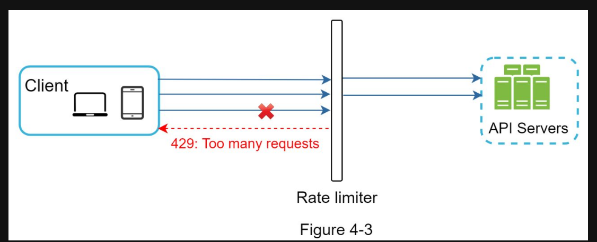
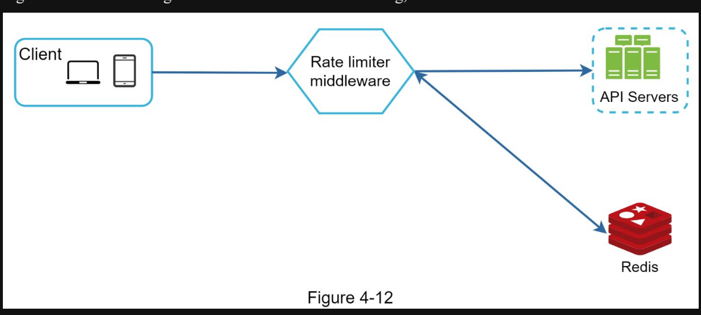
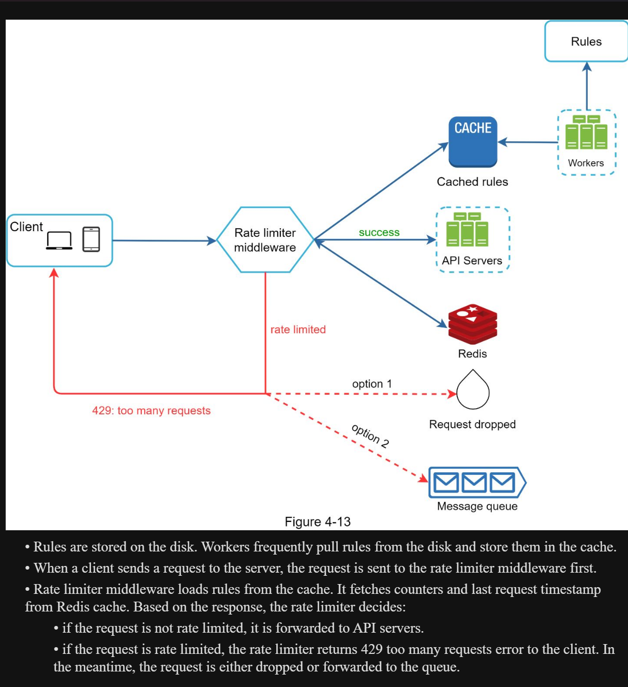
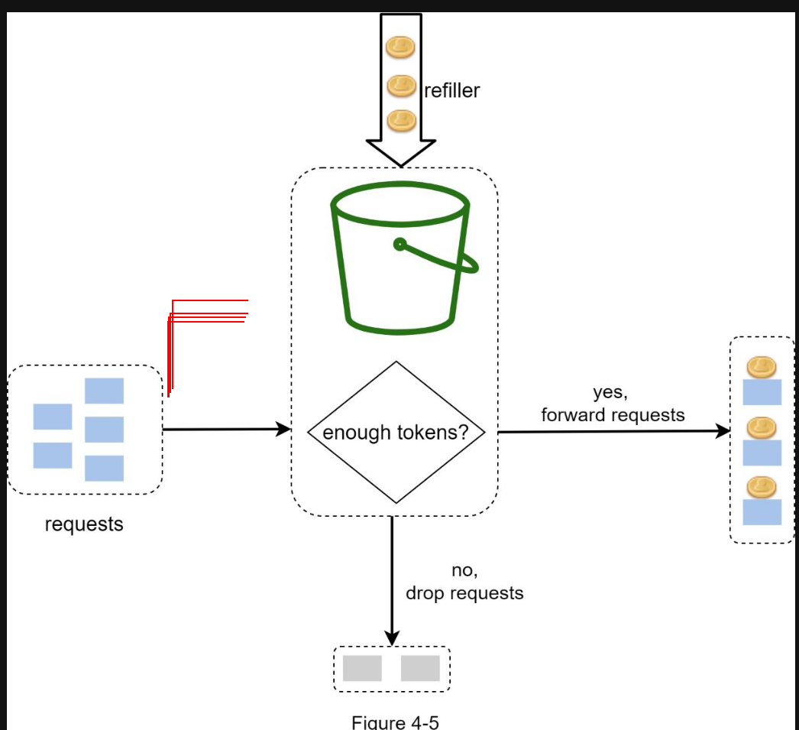
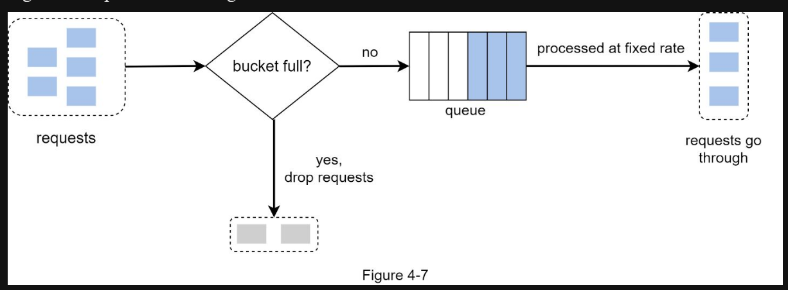
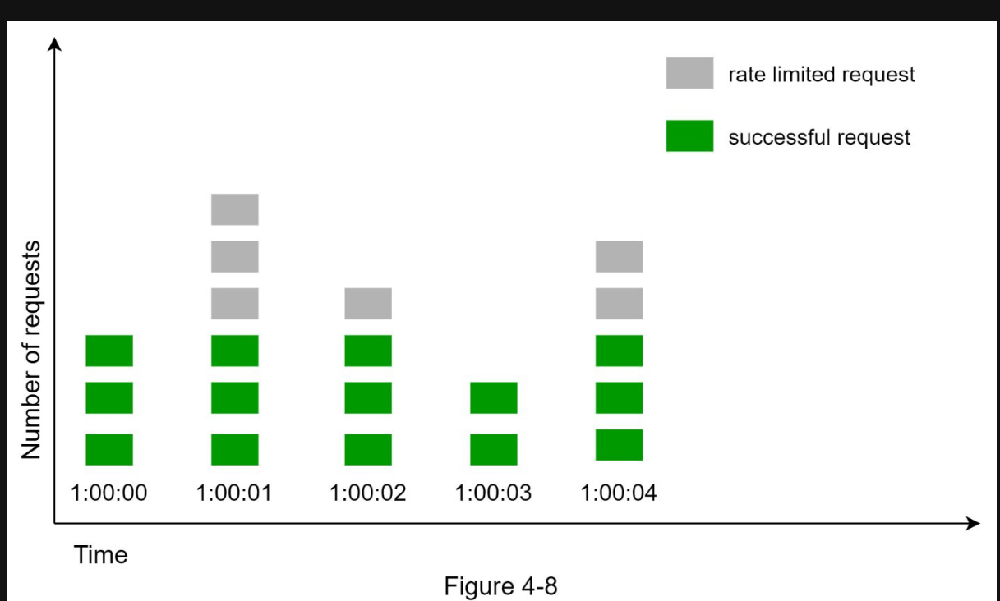

# MARKSHARP

# Rate Limiter

- A user can write no more than 2 posts per second.
- You can create a maximum of 10 accounts per day from the same IP address.
- You can claim rewards no more than 5 times per week from the same device.

Requirements:

- Server side API (Good Question: implement at Client Side or API Gateway Or Server side)
- support different sets of throttle rule
- handle a large number of requests.
- in a distributed environment
- separate service or should it be implemented in application code?
- Inform who throttled

Here is a summary of the requirements for the system:

- Accurately limit excessive requests.
- Low latency. The rate limiter should not slow down HTTP response time.
- Use as little memory as possible.
- Distributed rate limiting. The rate limiter can be shared across multiple servers or processes.
- Exception handling. Show clear exceptions to users when their requests are throttled.
- High fault tolerance. If there are any problems with the rate limiter (for example, a cache server goes offline), it does not affect the entire system.

# High Level Detail



- here the important of where to implement is that if do at client side it maybe hard because it user have a different type: ie: user may change the time zone, 
- So it easier if we do at server side, but where in the server side depent on current architect, in example if back end is resource intensive or it make the code base harder to maitain
- move to api gateway if you alreayd have one, so that sperate function 
- The basic idea of rate limiting algorithms is simple. At the high-level, we need a counter to keep track of how many requests are sent from the same user, IP address, etc. If the counter is larger than the limit, the request is disallowed.

Where shall we store counters? Using the database is not a good idea due to slowness of disk access. In-memory cache is chosen because it is fast and supports time-based expiration strategy. and redis have the expires field so we can add like `nodeID: 999, CurrentInBucket: 10, expries: oct 31st,2024`

if counter exeed our t- The client sends a request to rate limiting middleware.

- Rate limiting middleware fetches the counter from the corresponding bucket in Redis and checks if the limit is reached or not.
- If the limit is reached, the request is rejected.
- If the limit is not reached, the request is sent to API servers. Meanwhile, the system increments the counter and saves it back to Redis.

# Deep Dive:

limiting rules created: created with maybe a config file or an env or we can make it distributed by make like a db filed for this and then use cached to get the rule

- then we can inject into the software, where we can change it easily
    - sample can be 
    - 

```
domain: messaging

descriptors:

  - key: message_type

    Value: marketing

    rate_limit:

      unit: day

      requests_per_unit: 5

```

In case a request is rate limited, APIs return a HTTP response code 429 (too many requests) to the client.



# Distributed environment

1. Race condition: when 2 call write to one key it may unintentianllu allow more than what we allow 

- IN example: at time 1 update counter to 1  but at time 2, 2 sperate call to update counter +1 (in theory it should be 3 now so it allow both ), but in reality because at first it check the counter is still have enough space so it just allow and blindly appect that 2 new call.
- Solution: we can use pratice `atomic operation` like

```
let update = redis increase counter by 1
if update> allow Rule:
  block the call and decrease by one
else just continue foward that to backend 
```

2. Synchronization issue clients can send requests to a different rate limiter\

- use sticky sessions allow a client to send traffic to the same rate limiter ( advisable because it is neither scalable nor flexible)
- instead use mutiple redis at each of the rate limmter we can alow only one central redis to handel 

3. Performace optimization

- reduce latency by route traffic from one region to a specifc location that have the closet distance to our  serivce 

4. Monitoring

- add monitoring for when call blocked, 
- the rate limiting algorithm is effective.
- The rate limiting rules are effective.

For example, if rate limiting rules are too strict, many valid requests are dropped. In this case, we want to relax the rules a little bit. In another example, we notice our rate limiter becomes ineffective when there is a sudden increase in traffic like flash sales. In this scenario, we may replace the algorithm to support burst traffic. Token bucket is a good fit here. 

Avoid being rate limited. Design your client with best practices (`improvement`): 

•Use client cache to avoid making frequent API calls.

•Understand the limit and do not send too many requests in a short time frame.

•Include code to catch exceptions or errors so your client can gracefully recover from exceptions.

•Add sufficient back off time to retry logic.

### Importance of algo for rate limiting:

- Token bucket: A token bucket is a container that has pre-defined capacity. Tokens are put in the bucket at preset rates periodically. Once the bucket is full, no more tokens are added.

 

 main Components

- `Bucket Size: The maximum number of tokens in the bucket`
- `Refill Rate: number of token out into the bucket every second` 

How Many bucket:

- It is usually necessary to have different buckets for different API endpoints. For instance, if a user is allowed to make 1 post per second, add 150 friends per day, and like 5 posts per second, 3 buckets are required for each user. 
- of we need to throttle requests based on IP addresses, each IP address requires a bucket.
- If the system allows a maximum of 10,000 requests per second, it makes sense to have a global bucket shared by all requests.

Pros:

- The algorithm is easy to implement.
- Memory efficient.
- Token bucket allows a burst of traffic for short periods. A request can go through as long as there are tokens left.

Cons:

- Two parameters in the algorithm are bucket size and token refill rate. However, it might be challenging to tune them properly.

## Leaking bucket algorithm

The leaking bucket algorithm is similar to the token bucket except that requests are processed at a fixed rate. It is usually implemented with a first-in-first-out (FIFO) queue. The algorithm works as follows:

- When a request arrives, the system checks if the queue is full. If it is not full, the request is added to the queue.
- Otherwise, the request is dropped.
- Requests are pulled from the queue and processed at regular interval

Leaking bucket algorithm takes the following two parameters:

- Bucket size: it is equal to the queue size. The queue holds the requests to be processed at a fixed rate.
- Outflow rate: it defines how many requests can be processed at a fixed rate, usually in seconds.

Shopify, an ecommerce company, uses leaky buckets for rate-limiting [7].

Pros:

- Memory efficient given the limited queue size.
- Requests are processed at a fixed rate therefore it is suitable for use cases that a stable outflow rate is needed.

Cons:

- A burst of traffic fills up the queue with old requests, and if they are not processed in time, recent requests will be rate limited.
- There are two parameters in the algorithm. It might not be easy to tune them properly.

# Fixed window counter algorithm 

- The algorithm divides the timeline into fix-sized time windows and assign a counter for each window.
- Each request increments the counter by one.
- Once the counter reaches the pre-defined threshold, new requests are dropped until a new time window starts.

Pros:

- Memory efficient.
- Easy to understand.
- Resetting available quota at the end of a unit time window fits certain use cases.

Cons:

- Spike in traffic at the edges of a window could cause more requests than the allowed quota to go through: in example at edge more can be proeess during that short time