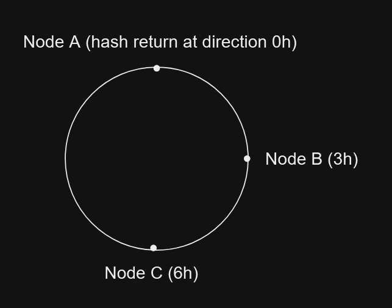
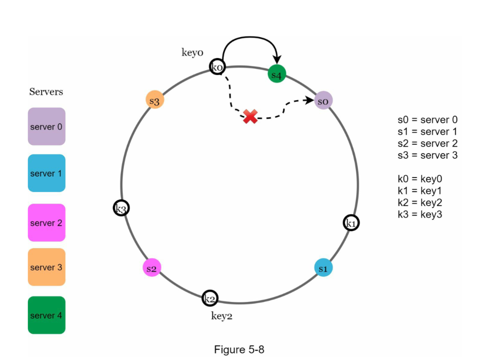

# What is Consistent Hashing?

Consistent hashing is a specialized hashing algorithm designed to distribute data across a dynamic set of nodes with minimal reorganization. Unlike traditional hashing methods, where adding or removing a node can lead to significant data reshuffling, consistent hashing ensures that only a small subset of keys need to be redistributed when changes occur in the system's node configuration.

# The rehashing problem

If you have n cache servers, a common way to balance the load is to use the following hash

method:

`serverIndex = hash(key) % N, where N is the size of the server pool.`

so 

So to check a key and get which node the data is on, ie: `from userID get data from that usre node`

This work really well when the number of node is fixed, but that imposible to maintained at all time in a distributed system, so ie: one node down and all the data on that node need to distribute back to the other node

`serverIndex = hash(key)  % (N-1)` 

but the problem is that to distributed all the data back to all other node it take time and make the system inconsistent. or if we add we need to dstribute all data again

# Solution: consistent hasing 

Imgain a hash ring use Sha-1 that return a number in range `0 and 2^160`

and the end is connected to the end like a ring 

now if we want to find `serverIndex = hash(key)`

still almost the same with ourt module method, but this time if node B down, instead of  distribute data to A and B it only need distrubute data to node C (Asusme we use clockwise ), and this work really well if want to add a new node, so the search for `serverIndex = hash(key) + 1 uuntill we found a node (this node will garentee have that key)` 

Easy to add new node too, new key just add to the clockwise closet node

One of the problem

- hard to keep a balance betwwen data in each node, so some of the node gonna carry more data than the others,
- second be cause it is a hash and we use clockwise rule some time there may be a large distance from one node to orther so it make data just write to that only node only

Solution:

- Virtual nodes: we can implement addtional virtual nodes on the point, example hash(node_name) return 1 then we can do a reference point to may be at 5 and 10 so we  any key from that can write to thatnode, this work really well when we have impalance resource betwwen each node: ie we know node 1 is stronger than node 2, then we can priotize more write to node 1(more virtual node), 
- when we add or remove node, we can go counter clockwise from the new node to the next node and every key can write to that new node

 The benefits of consistent hashing include:

- Minimized keys are redistributed when servers are added or removed.

- It is easy to scale horizontally because data are more evenly distributed.

- Mitigate hotspot key problem. Excessive access to a specific shard could cause server

overload. Imagine data for Katy Perry, Justin Bieber, and Lady Gaga all end up on the

same shard. Consistent hashing helps to mitigate the problem by distributing the data more

evenly.

Consistent hashing is widely used in real-world systems, including some notable ones:

- Partitioning component of Amazon’s Dynamo database [3]

- Data partitioning across the cluster in Apache Cassandra [4]

- Discord chat application [5]

- Akamai content delivery network [6]

- Maglev network load balancer [7]