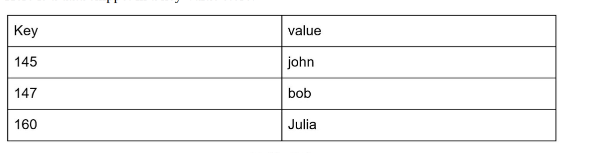
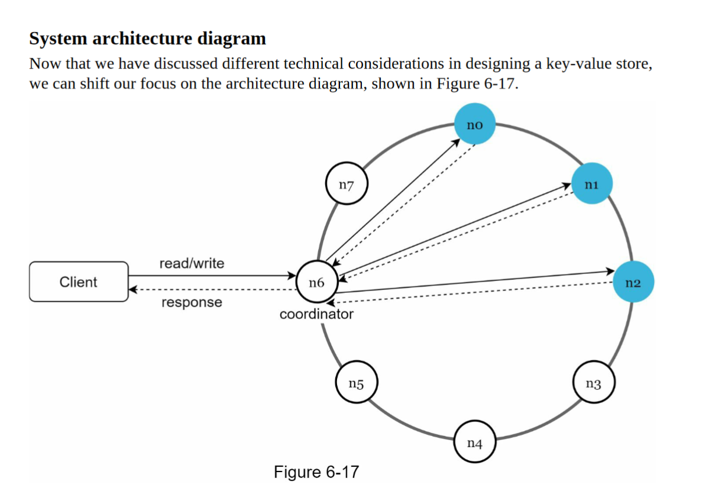
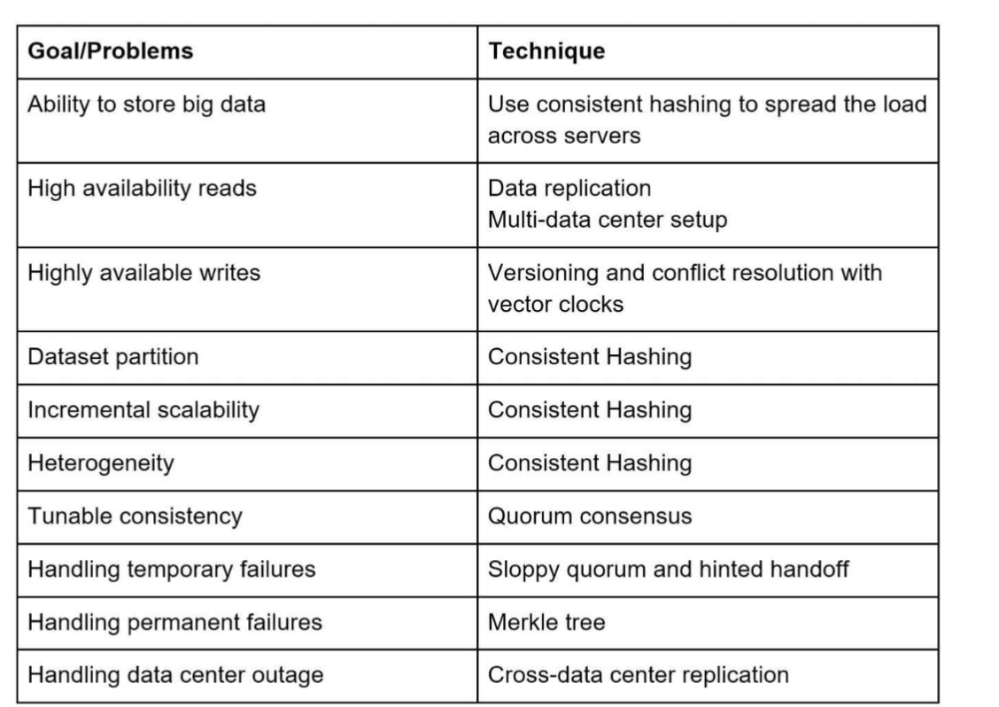

# Requrements

 Use Cases: like redis, memcached, or Amazon dynamo 

Usage patten: like above table

Good Question: How many people do we epected to served, are they acrros many region,

Based on the Cap Theorem:

- How much Consistent do we need: weak, strong, or eventually?
- How much Avalability do we need: 24/7, or some downtime can be acctable , in case downtime acctable then maximum time for it and why we need that down time (• Low latency.)
- Partion tolerance: if one node down, can the system still work as normal, in short the system should continues to operate despite dropped or delayed messages between the distributed nodes.
- put(key, value) // insert “value” associated with “key”
- get(key) // get “value” associated with “key

And as the Theorem stated: it maybe hard to achieve the bove 3 points but we can allow for a trade off 

• The size of a key-value pair is small: less than 10 KB.

• Ability to store big data (how big is this, first let work well on samll size first )

- does it support text, image, video, ...

• High availability: The system responds quickly, even during failures.

• High scalability: The system can be scaled to support large data set.

• Automatic scaling: The addition/deletion of servers should be automatic based on traffic.

• Tunable consistency.

• Low latency.

### 1) Estimation

Supposely at t0 we want to support about 100 custmer and each will try to make about 1000 CRUD operion per day

so 100 000 Operations per day, get average like 7KB so 700 000 KB= 700 MB a day 

2 100 000 MB= about 2 TB 

### 2) Basic logical thinking

Because it just key value store, so we can just make simple hash table where the key gonna be the hash and input into the memoery in a single machine,

- but as the number of data incrase it may not be efficientlt
    - we can use data compression and maybe use like a LRU cache to improve read speed, but it not really good to just do on one machine so we should use a distributed system  

### 3) Some solutions

- Data partition
    - This we can reolve using consistent hasing 
- Data replication
    - we can use a leader-follower based appoach, where it will handel all the write and 
    - in a all leaderless, we just simply write data on a node and read data on all node, the consistence can be improve by apply a diff or versioning 
        - with combination of sloppy qorum, so that instead instead of wait and confirm all of the data from all node is the same we can choose a ratio that conifrm betwwen
- Consistency
- Inconsistency resolution
- Handling failures
- System architecture diagram
- Write path
- Read path

Diagram

• Clients communicate with the key-value store through simple APIs: get(key) and put(key,

value).

• A coordinator is a node that acts as a proxy between the client and the key-value store.

• Nodes are distributed on a ring using consistent hashing.

• The system is completely decentralized so adding and moving nodes can be automatic.

• Data is replicated at multiple nodes.

• There is no single point of failure as every node has the same set of responsibilities

