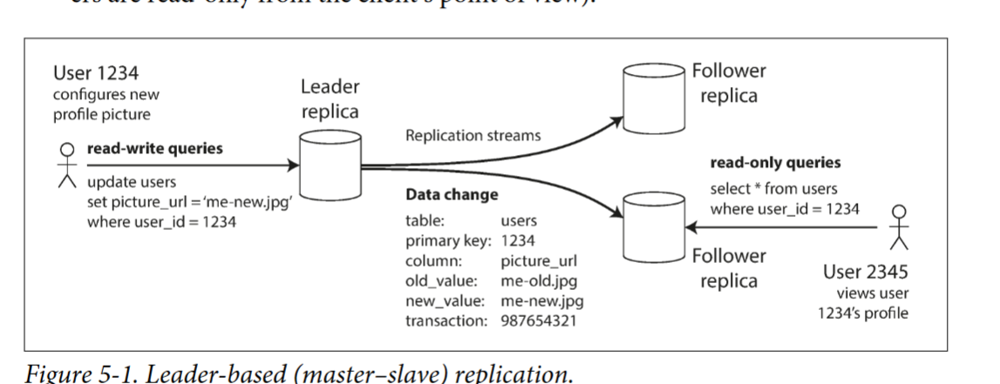

# Replication typoe
- Leaders and Followers
- - 
- - but the key is chose Synchronous Versus Asynchronous Replication
  - Synchronous: wait for each of node veryfy the write is true then procceed:  follower is guaranteed to have an up-to-date copy of the data that is consistent with the leader but it take time to wait for all of them to confirm the write so `good approach is allow like some of them to have that write and the rest is asynchonous`
  - Asynchronous: dont wait just sent the write to all
  - we can trade off alltte by make some of them by ` take snap shot` and then add like a backlog and add new data from that snapshot

### Node Outage
 - fail-over appoach, only one node is the leader so if leader die than we can choose any of the follower to be the new leader
   - the new leader can have some preoblem

# so in a distributed system there will always be a delay due to connection
- inconsistent happen 2 backend update/write to 2 node then how to tell which should be the good one? (simple we can do a last write win based on time stamp)
- or we can make sperate data fiiled that store the diff betwwen 2 version