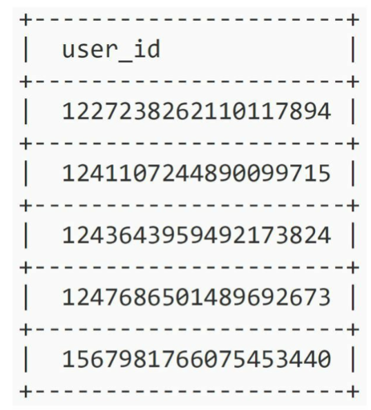
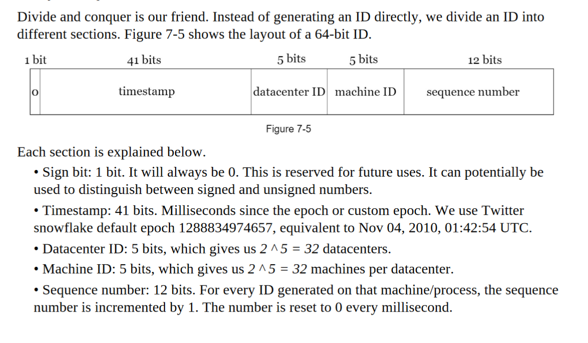

Use Cases: GET api/newID

- in a unique ID generator in distributed systems
- 

#  Understand the problem

- What do you mean by unique ID?
    - Id must be nique and sortable

IDs must be unique.

• IDs are numerical values only.

• IDs fit into 64-bit.

• IDs are ordered by date.

• Ability to generate over 10,000 unique IDs per second.

# Logical thikning

- simple server call update +1 evertyime, or add the time stamp
- UUIDs  is a 128-bit number so probability that 2 node genrate the same id is quite low, so generate new number check in db if it existed , if it is then get a new one
- Pros:

  • Generating UUID is simple. No coordination between servers is needed so there will not

  be any synchronization issues.

  • The system is easy to scale because each web server is responsible for generating IDs

  they consume. ID generator can easily scale with web servers.

  Cons:

  • IDs are 128 bits long, but our requirement is 64 bits.

  • IDs do not go up with time.

  • IDs could be non-numeric.

